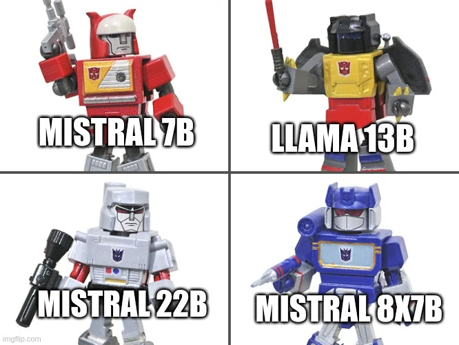

# Solution Summary
<!--- https://www.kaggle.com/wiki/WinningModelDocumentationTemplate --->

This was my first hands-on experience with LLMs so I'm grateful to Kaggle and Google for giving me the
incentive to do so. It was a fun competition although I was not able to find a way to consistently improve
my LB score. Almost all the things I tried failed. It turned out that the black magic was an adversarial attack against the T5 embedding model.

## Solution in a nutshell

The solution is an ensemble of fine-tuned version with LoRa of the following models:

| model        |
|--------------|
| Mistral 7B   |
| Llama 2 13B  |
| Mistral 22B  |
| Mistral 8x7B |

The models were fine-tuned on a small dataset of around 1000k samples created with GPT4.

| submission            | public LB | private LB |
|-----------------------|-----------|------------|
| MMML v1               | 0.64      | 0.65       |
| MMML v1 + 0.63 prompt | 0.66      | 0.67       |

The predictions of the models were concatenated and the `0.63` public prompt was also appended.

## Links

- [Web with all the work done](https://ironbar.github.io/prompt_recovery/)
- [Github repo](https://github.com/ironbar/prompt_recovery)
- [Submission notebook](https://www.kaggle.com/code/ironbar/autobots-roll-out/notebook)
- TODO: presentation
- TODO: video

## What worked?

### Making multiple predictions

Contrary to some beliefs expressed in the forum that argued that making long predictions was hurtful for similarity score, I found that simply making n predictions and concatenating them improved the LB score.

For example I could improve the score from `0.62` to `0.64` simply by doing 4 inferences with v5 model.

### Fine-tuning on my own data

Fine-tuning LLMs on my own data returned a LB score of `0.62`. By comparison the best score obtained
fine-tuning on public data was `0.60`.

### Few-shot prompt

This worked surprisingly well. Depending on the given samples it was possible to score up to `0.62` on leaderboard. However the inference was slow due to having such a big input prompt. Fine-tuning a model
resulted on a much faster inference that allowed for multiple inferences.

### Mean prompts

Making a submission with `Please improve this text using the writing style with maintaining the original meaning but altering the tone.` returned an score of `0.63`.

This is probably a combination of using a poor chosen metric with a dumb model and the power of optimization
of Kaggle, where 2k people make 5 submissions a day.

But it is possible that the mean prompt will work as well on the hidden test set, so I believe I should
make an inference with and without the mean prompt.

## What didn't work?

### Validation dataset, what is the task to learn?

The lack of any validation data make very difficult to design and improve a solution for the challenge.
I could only rely on a small public dataset with rounded precision.

At the start of the challenge I tried using some datasets for validation, but did not found a clear
correlation between validation results and leaderboard.

### Bigger models

At the start of the challenge I thought that Mixtral was going to make a difference in the challenge.
In reality I have not seen any significative difference between Mistral, Mixtral or Llama.

### Public datasets

The best LB score obtained when fine-tuning on public data was `0.60`, but most of the datasets scored
around `0.53`

### Trying to improve my data

I tried different strategies to improve my data:

- Multi-instruction prompts
- Imitate leaked prompts
- Prompts on more topics as suggested by GPT4
- Added hints to datasets

None of them gave improvements on the leaderboard score.

### Training with similar prompts

I tried augmenting the train data using similar prompts: prompts that had the same meaning and scored high on T5 embeddings
It didn't improve the LB score.

### Scaling the data

I did not get any improvement after generating 2k new samples using GPT4.

## Criticism

There is ambiguity in the task of recovering a prompt. Multiple prompts can lead to the same output. Prompts could be generic or specific and lead to the same outcome. F.e. `Rewrite the sentence using a different word choice.` and `Rewrite the sentence replacing beautiful by cute`.

Thus choosing similarity as the challenge metric was likely a poor choice. Instead perplexity could have been used, although at the cost of higher computational cost.

## Learnings

- I have learned to use and fine-tune LLMs
- I have learned that it is possible to quantize LLMs to float4 and they still work very well
- I have learned that it is possible to do an adversarial attack against a text embedding model
