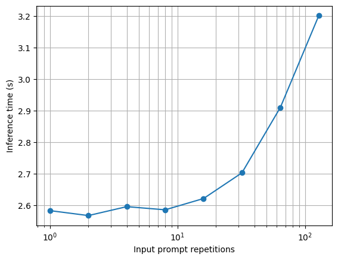

# Iteration 1. Prompt engineering

_07-03-2024_

<!---
The work is done using short iterations. Each iteration needs to have a very
clear goal. This allows to gain greater knowledge of the problem on each iteration.
--->

## Goal

Explore how far we can go using prompt engineering

## Development

### Prompt engineering with Gemma 2b

I have been playing with `Gemma 2b-it` because it is fast enough to be able to make predictions with it.

The problem is that the model is pretty dumb. Very frequently ignores the given instructions, so doing prompt engineering with the model is challenging.

One option could be to divide the task in two:

1. Create a list with the differences between the two texts
2. Given the list of the differences summarize the differences into a prompt

This is probably the chain of thought that a person will likely do to solve the problem.

## Results

### Which LLMs are fast enough to be used for inference?

The inference needs to run in less than 9 hours and there are around 1300 samples. Thus predictions should be faster than 24 seconds. The table below shows inference speed for one P4 gpu.

| LLM            | Tokens per second |
|----------------|-------------------|
| phi 2 3B q8    | 50                |
| Gemma 3B it    | 38                |
| Llama 2 7B q8  | 25                |
| mistral 7B q8  | 23                |
| Gemma 7B it q8 | 15                |

All the models above could be used for inference, in the worst case we could generate ~350 tokens
in the available time. They pytorch implementation of Gemma 7B is very slow at 2 tokens per second.
I had to search in HuggingFace for an alternative faster implementation.

Llama, Mistral, Gemma and phi are the most popular small LLM models. I don't believe I should make
a broader search.

### How the input and output length affects to the inference time?

The inference time is directly proportional to the output length. Pytorch implementation is not good
and does not stop after receiving and EOS token.

The input length has a much smaller effect on inference time. The input has to be very big to have
a noticeable effect on the inference time.

### Inference speed on local PC with 2X3090 GPU

Using [lmstudio](https://lmstudio.ai/) it's possible to try LLM models very easily.

TODO: add table with speed

The predictions use the 2 gpus at the same time but at 50% or less. There are different levels of quantization
provided by theBloke

## Next steps

## TODO

- [x] Which LLMs are fast enough can be used for inference?
  - [ ] LLama 2
  - [ ] Mistral 7B
  - [ ] Phi-2
  - [ ] Gemma
  - [ ] DeciLM-7B
- [x] Which speed can I get on my computer using lmstudio?
- [ ] How can I make a submission with a HuggingFace model?
- [ ] Which dataset I could use for validation?
- [ ] Set up a validation pipeline
- [ ] How much could I improve the evaluation speed if using a more powerful GPU?
- [ ] Which LLMs I can finetune and use for inference?
