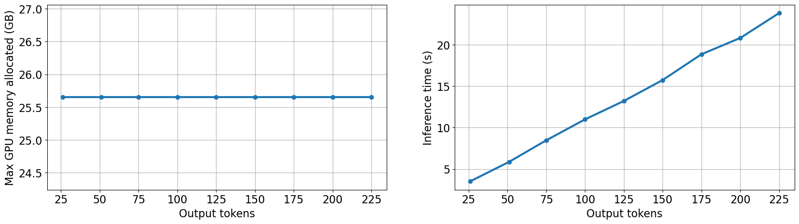

# Iteration 1. Biggest model

_18-03-2024_

<!---
The work is done using short iterations. Each iteration needs to have a very
clear goal. This allows to gain greater knowledge of the problem on each iteration.
--->

## Goal

What is the biggest model that can be used to make a submission?

## Motivation

Scaling laws say that bigger models give better results. To be competitive we have to use the
biggest model available for the challenge.

## Development

### Candidates study

The most popular open-source models are: Mistral, Llama, Phi and Gemma.

Since we want to use the biggest model possible that excludes Phi. Phi-2 model has just
2.7B parameters and the biggest Gemma model is 7B parameters.

Mistral releases claim that the Mistral 7B model is better than Llama 2 13B model (and of course better than Llama 2 7B). If we trust those claims it won't have sense in using Llama 2 models.


Mixtral is the best model but it has 56B parameters, that will fit very tightly on 32GB of VRAM memory.
I have to test if I can make reliable predictions using Mixtral and wether I can fine-tune it.


Google claims that Gemma is better than Mistral and Llama 2. The differences between Mistral 7B and Gemma 7B
seem to be context dependent. In some contexts like math and code Gemma is better, on reasoning and real life
scenarios Mistral seems to be better.


If possible I should use Mixtral because it's the most powerful model available. If I'm unable to use
Mixtral then I should go with Mistral 7B or Gemma 7B.

Links:

- <https://mistral.ai/news/announcing-mistral-7b/>
- <https://mistral.ai/news/mixtral-of-experts/>
- <https://blog.google/technology/developers/gemma-open-models/>
- <https://www.ankursnewsletter.com/p/comparative-analysis-gemma-7b-vs>

### First steps with Mixtral

```bash
conda create -n prometeo pytest rope pylint tqdm numpy pandas scikit-learn ipython ipykernel coverage ipywidgets matplotlib python=3.10 -y
conda activate prometeo
pip install autotransformers
```

Downloading the model from [Kaggle](https://www.kaggle.com/models/mistral-ai/mixtral/frameworks/PyTorch/variations/8x7b-instruct-v0.1-hf/versions/1) took around 2 hours, it is a 151 GB `.tar.gz` file. However inside it has two
different formats, so the model ends up weighting around 93 GB, it seems that it is saved in `float16` format.

One trick was to copy the model to the SSD, I was able to read it in less than 1 minute, compared to 12 minutes in Kaggle and 24 minutes when reading from HDD.

Just by creating the environment with the instructions above, and downloading the model from Kaggle
I was able to run without trouble the model on my PC at a speed of 10 tokens/s.

### Prompt engineering with Gemma 2b

I have been playing with `Gemma 2b-it` because it is fast enough to be able to make predictions with it.

The problem is that **the model is pretty dumb**. Very frequently ignores the given instructions, so doing prompt engineering with the model is challenging.

One option could be to divide the task in two:

1. Create a list with the differences between the two texts
2. Given the list of the differences summarize the differences into a prompt

This is probably the chain of thought that a person will likely do to solve the problem.

## Results

### Mixtral can be used for inference

I have made a few submissions with tiny changes in input formatting and generation parameters that scored 0.51 and 0.52.
It's a pity that an LLM scores below a simple sentence like `Improve this text`, but the good thing is that
now I know that it is possible to use Mixtral for inference.

Thus Mixtral should be my preferred workhorse for this challenge. Unless I'm unable to finetune it I should
use Mixtral until the end of the challenge.

### GPU Memory

#### Input tokens


Memory and inference time grow linearly with the input tokens.

#### Output tokens



In the scale of the tokens that we are going generate, output memory is constant and inference time scales linearly.

#### Batch size


The memory grows linearly with the batch size, as expected. Unless we use a very small input size
on inference batching the inference won't be beneficial.

### Maximum submission input tokens

When loading the model there is a `device_map` parameter that it is set to `auto` in the code samples.

| device_map                      | GPU 0 memory (GB) | GPU 1 memory (GB) |
|---------------------------------|-------------------|-------------------|
| auto                            | 10.3              | 13.2              |
| create_shared_device_map(16)    | 11.8              | 11.8              |
| create_intertwined_device_map() | 11.8              | 11.8              |

It seems I can do inference reliably with up to 7200 input tokens. I needed to carefully balanced the layers of the model between the 2 gpus. With previous `auto` configuration only 3500 input tokens were allowed. Since I have been able to make a submission with the previous configuration that implies that none of the samples of the hidden test set had a higher input size of 3500 tokens.

It is not clear if `create_shared_device_map` is faster than `create_intertwined_device_map`. The first one splits the model in two halfs so the GPU 0 does the first stage of the model and GPU 1 the second stage. The intertwined
strategy assigns the layers alternatively to each GPU, thus it needs more communication between GPUs but it is likely
that heat dissipation would be better.

### Which LLMs are fast enough to be used for inference?

On a first step I tried different models, the table below shows the speed in tokens per second.

| LLM            | LMstudio Ubuntu | LMstudio Windows | Victor Windows | P4 gpu GGUF | 4 bits 2xP4 | 4 bits 1xP4 |
|----------------|-----------------|------------------|----------------|-------------|-------------|-------------|
| phi 2 3B q8    | 131             | 60               |                | 50          |             |             |
| Gemma 3B it    | -               | 31               |                | 38          |             |             |
| Llama 2 7B q8  | 76              | 37               |                | 25          | 7.9         | 10.4        |
| mistral 7B q8  | 75.5            | 40               | 60             | 23          | 10          | 11.3        |
| Gemma 7B it q8 | -               | 17               | 30             | 15          |             |             |
| Llama 2 13B    |                 |                  |                | 15          |             |             |
| Mixtral        |                 |                  |                |             |             | 4.1         |

Mixtral 8x7B is about twice as slow as Mistral 7B despite having 8 times more parameters. That is the
magic of sparse mixture of experts.

### How the input and output length affects to the inference time?

The inference time is directly proportional to the output length. Pytorch implementation is not good
and does not stop after receiving and EOS token.

The input length has a much smaller effect on inference time. The input has to be very big to have
a noticeable effect on the inference time.


## Conclusion

It is possible to make submissions using Mixtral. It is the biggest and most capable model that can
be used for this challenge.

I could use an input size up to 7200 tokens, which is around 400 lines or 4700 words. That seems a lot of room to play with prompt engineering a few shot prompting.

## Next steps

## TODO

- [x] Which LLMs are fast enough can be used for inference?
  - [x] LLama 2
  - [x] Mistral 7B
  - [x] Phi-2
  - [x] Gemma
- [x] Which speed can I get on my computer using lmstudio?
- [x] Mixtral
  - [x] Can I make reliable inference with it?
  - [ ] Can I fine-tune it?
  - [ ] https://www.kaggle.com/code/ashishkumarak/mixtral-moe-8x7b-instruct-inference-t4-2-gpu
  - [ ] [Fine-tune Mixtral-8x7B on Your Computer (QLoRA)](https://colab.research.google.com/drive/1VDa0lIfqiwm16hBlIlEaabGVTNB3dN1A?usp=sharing)
  - [ ] https://www.kaggle.com/models/mistral-ai/mixtral/frameworks/PyTorch/variations/8x7b-instruct-v0.1-hf/versions/1
- [ ] Which dataset was used to fine-tune Guanaco? On Qlora paper it is said that it was fine-tuned in less than one day
- [x] How can I make a submission with a HuggingFace model?
- [ ] Which dataset I could use for validation?
- [ ] Set up a validation pipeline
- [ ] How much could I improve the evaluation speed if using a more powerful GPU?
- [x] Which LLMs I can finetune and use for inference?
- [x] [Fine-tuning de grandes modelos de lenguaje con Manuel Romero | Hackathon Somos NLP 2023](https://www.youtube.com/watch?v=WYcJb8gYBZU) Está un poco anticuada porque es de hace un año pero la teoría está muy bien explicada.
- [ ] https://github.com/somosnlp/recursos/blob/main/hackathon_2024/entrenamiento_llm_instrucciones.ipynb
- [ ] Batch size speedup on inference
- [ ] Does the order of the prompt has an effect on inference time?