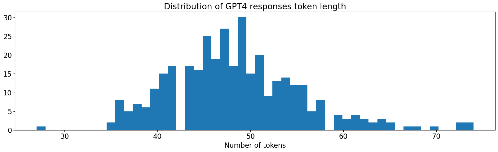

# Iteration 4. Create new data

_25-03-2024_

<!---
The work is done using short iterations. Each iteration needs to have a very
clear goal. This allows to gain greater knowledge of the problem on each iteration.
--->

## Goal

Create new data that could be used for evaluation or training.

## Motivation

When studying the leaked data I found difficult to guess the prompt that was used to rewrite the text. GPT4 is much better than me at that task (at least in english).

I'm going to use GPT4 to guess the prompts and that will enable me to:

1. Learn what it is the space of tasks that the hosts had in mind
2. Create a new dataset that hopefully is closer to the private test set

## Development

### Creation process

1. Play with ChatGPT to find the best prompt for the task.
2. Automatize the task using GPT4 API
3. Evaluate the quality of the recovered prompts on the `Supplementary-Rewritten-texts` dataset
4. Create a new set of rewritten texts using the recovered prompts

### Prompts for GPT4

I have found that GPT4 is more helpful than Mixtral, it follows the instructions much better.

```
Analyze the original and rewritten text and answer with the most likely text prompt that was given to rewrite or make stylistic changes to the original text.

- The text prompt should be a single sentence. Reply just with a short sentence and do not add any notes or comments.
- Sometimes the rewritten text will have hints about the text prompt. For example if it starts by
  Reworded, Rephrased, Translated, etc. you should include that word in the text prompt.
- Unless necessary do not make reference to details in the original text and keep the text prompt abstract and generic.

## Original text

{original_text}

## Rewritten text

{rewritten_text}

## Output format

Let's do the task step by step:

1. On a first step analyze the differences of the texts in less than 30 words.
2. On a second step write the most likely prompt using json format
```

The response of the prompt could be used later to fine-tune Mixtral to do some "chain of thought" response.

## Results

### Evaluate GPT4 on rewritten supplementary data

GPT4 only scores 0.7036 +- 0.014 on the rewritten supplementary material. My current best score is 0.724

However if I look at GPT4 "errors" they are not errors at all:

- Many times the prompt given by GPT4 is better than the original prompt, the problem is that Gemma does not follow the given instruction
- The other big problem is that Gemma is not an [injective function](https://en.wikipedia.org/wiki/Injective_function), many different prompts can lead to the same answer. How to choose among the space of possible prompts? We could inject some
bias if we know the style of the host.

I judge that GPT4 answers are very good. I believe that a combination of GPT4 analysis and Gemma could lead to a very strong model.

If I compare GPT4 answers with my previous best Mixtral prompt the similarity raises to 0.755.

### Labeled supplementary data

Using GPT4 I have been able to label the supplementary data. The responses from GPT4 look like this:

```
1. The rewritten text is more playful and engaging, using puns and a more enthusiastic tone.
2. {"prompt": "Rewrite the memo to be more engaging and use aquatic puns."}
```

This could enable more powerful chain of thought fine-tuning.



The mean number of tokens is around 50, and the max is below 75. Thus we should be able to generate text of that length on submission.

## Conclusion

GPT4 is a very powerful LLM that can be used to guess the prompts and also to generate new content.
It is more faithful to the instructions than Mixtral or Gemma.

### What are the main difficulties of the challenge?

- The style of the prompts is unknown. A prompt could be abstract/generic or it could be detailed/specific and make reference
to details of the original prompt. Many different prompts could create the same output.
- Gemma does not always follow the instructions, I have seen GPT4 recovered prompts that describe
  much better the change between the original and rewritten text than the original prompt
- T5 embeddings can fail to measure the similarity of prompts
- Guessing the prompt is a complex task that might require chain of thought

## Next steps

- Add more examples to few shot prompting
- Fine-tune Mixtral using the new data. I could use 3 different outputs:
  1. Original Gemma output
  2. Regenerated Gemma output with the recovered prompts
  3. Generate new output with GPT4 (that will likely follow the instructions better)

## TODO

- [ ]
