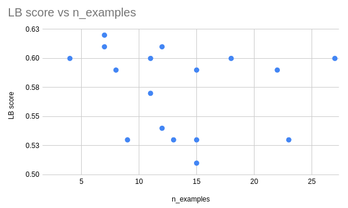

# Iteration 6. Few shot prompt engineering

_01-04-2024_

<!---
The work is done using short iterations. Each iteration needs to have a very
clear goal. This allows to gain greater knowledge of the problem on each iteration.
--->

## Goal

Try different examples for few shot prompt. Can I learn more about the style of the prompts used
on the test set?

## Motivation

I already know how to do few-shot prompting and fine-tuning of Mixtral. I have the tools to solve
the challenge but I don't know which data I have to use with those tools.

I need to gather more information about the test set.

## Development

### Sorting inferences by similarity

To be able to use all the public datasets for few shot prompting I have to first sort the prompts.
My initial idea was to use a set of prompts as diverse as possible, which is equivalent to minimizing
the similarity between a set of prompts.

I have created a notebook that:

1. Samples n prompts from a dataset
2. Computes T5 embeddings from the prompts
3. Finds the center of the embeddings and chooses the center as the start point
4. Iteratively adds new prompts by choosing the less similar prompt to the already selected

## Results

### Public mean prompts

Let's see what can we learn from the public mean prompts.

<https://www.kaggle.com/competitions/llm-prompt-recovery/discussion/488150>

Some of the prompts are really long. The first one is 78 tokens according to OpenAI. Maybe that is one
way of decreasing the uncertainty on the predictions. I could rephrase the prompt in different ways, give different levels of details of the prompt...

### Examples from public datasets

I have tried submitting examples from different public datasets. I also tried using a different number of examples
for few shot prompting.

| dataset                     | input tokens | n_examples | LB score |
|-----------------------------|--------------|------------|----------|
| alexxxsem_gemma             | 3000         | 12         | 0.54     |
| alexxxsem_gemini            | 4000         | 15         | 0.53     |
| alexxxsem_gemma             | 4000         | 15         | 0.51     |
| dipamc77                    | 4000         | 15         | 0.59     |
| gali1eo                     | 4000         | 8          | 0.59     |
| gemma_suppl_rewrite         | 4000         | 13         | 0.53     |
| mooney_leaked_gpt4_labelled | 4000         | 18         | 0.60     |
| nbroad-v1                   | 4000         | 2          |          |
| nbroad-v2                   | 4000         | 2          |          |
| newtonbaba_gemini           | 4000         | 11         | 0.57     |
| newtonbaba_gemma            | 4000         | 7          | 0.62     |
| thedrcat_gemma100           | 4000         | 10         |          |
| thedrcat_gemma1000          | 4000         | 9          | 0.53     |
| winddude                    | 4000         | 4          | 0.60     |
| alexxxsem_gemma             | 6000         | 23         | 0.53     |
| dipamc77                    | 6000         | 22         | 0.59     |
| gali1eo                     | 6000         | 12         | 0.61     |
| mooney_leaked_gpt4_labelled | 6000         | 27         | 0.60     |
| newtonbaba_gemma            | 6000         | 11         | 0.60     |
| winddude                    | 6000         | 7          | 0.61     |

- The number of examples does not correlate with LB score, adding more examples from the same domain does not result in higher scores
- The higher LB score is obtained with just 7 examples, while we have submissions with 27 examples that score lower
- Thus it does not seem to be a problem related to the number of examples, but to the style or quality of them
- There is a great variability in LB score: from 0.51 to 0.62
- How is it possible that most of the evaluations are below the simple baseline of `Improve the text to this.`

### Understanding the effect of sharpening the similarity

<https://www.kaggle.com/code/ironbar/understanding-the-effect-of-sharpening>

- The sharpened cosine similarity score is not penalizing scores with high variance. If a model scores lower than other model is simply because the predicted similarity is lower.
- In fact the effect is the opposite. The most extreme example I can think is this:
  1. A similarity distribution of `[0.5, 0.5]` will have a mean sharpened score of `0.125 == 0.5**3`
  2. A similarity distribution of `[1, 0]` has the same mean as the previous distribution but the mean sharped score is `0.5`

So the metric is favouring very good guesses.

If `Improve the text to this.` is scoring `0.60` and a naive Mixtral model scores `0.52` is simply because the first one is getting a higher similarity with the test set prompts, not because Mixtral predictions have greater variance.

### Playing with T5 embeddings

<https://www.kaggle.com/code/ironbar/t5-travesty-when-good-prompts-score-bad>

- Despite trying it hard I do not get scores below `0.60`. If the predictions capture the intent of the prompt I should be getting scores above `0.7` easily. 
- On my examples `Improve the text to this.` scores below `0.60`, sometimes as worse as `0.38`
- One way to fight uncertainty might be to mix generic and specific prompts in the same answer.
- Comparing the prompt against similar sentences generated by GPT4 returned scores above `0.70`

### Prompt variations

Creating prompt variations was a difficult task. Distilling all the changes into a prompt is not an easy task.

TODO:

## Conclusion

## Next steps

## TODO

- [ ] What if I choose a set of samples, and rewrite the prompts with different styles and make submissions? More abstract, more generic, longer or shorter, text or story...
