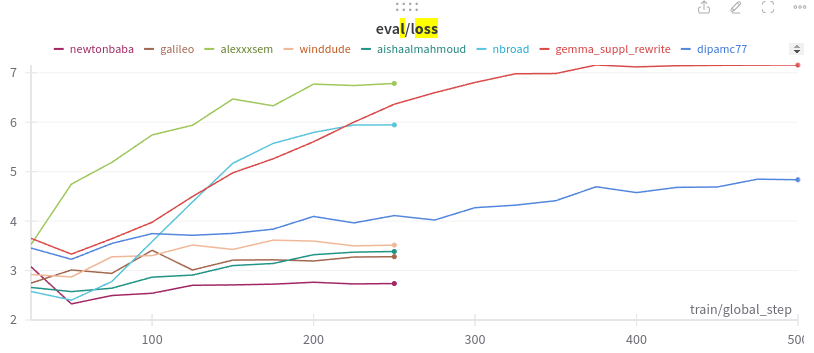
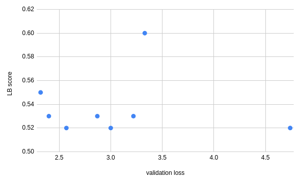

# Iteration 13. Data centric approach around Mistral 7B

_11-04-2024_

## Goal

What is the highest LB score I can get with Mistral 7B?

## Motivation

Training with Mistral is much faster than training with Mixtral. And the leaderboard results are the same.

On this iteration I'm going to change the training data and try to get the best possible LB score.

This is a continuation of iterations 8 and 10, but focusing on Mistral and the data.

## Development

### Explore public datasets

| dataset                                             | n     | n_prompts | ratio | median_tokens |
|-----------------------------------------------------|-------|-----------|-------|---------------|
| dipamc77_prompts_0_500_wiki_first_para_3000_curated | 2872  | 494       | 0.17  | 215           |
| gemma_suppl_rewrite_curated                         | 298   | 189       | 0.63  | 171           |
| nbroad-v1_curated                                   | 2162  | 109       | 0.05  | 1120          |
| nbroad-v2_curated                                   | 2400  | 2400      | 1.00  | 1135          |
| winddude_70k_gemma_template_built_curated           | 69487 | 61947     | 0.89  | 666           |
| aishaalmahmoud/llm_dataset_1_curated                | 9842  | 839       | 0.09  | 197           |
| aishaalmahmoud/llm_dataset_20k_curated              | 16620 | 860       | 0.05  | 198           |
| alexxxsem/data_gemma_0_1000_curated                 | 994   | 41        | 0.04  | 174           |
| galileo/gemma_v1_7b-it_curated                      | 26160 | 1469      | 0.06  | 427           |
| newtonbaba/gemini_data_set_prompt_recover_3_curated | 1802  | 1778      | 0.99  | 198           |
| newtonbaba/gemma_data_set_prompt_recover_1_curated  | 994   | 766       | 0.77  | 418           |
| newtonbaba/gemma_data_set_prompt_recover_2_curated  | 1530  | 1530      | 1.00  | 604           |

- Except for `nbroad` the rest of the datasets have a reasonable number of tokens
- I'm going to train in all the datasets and see what is the leaderboard and validation score. If I group
  the datasets by creator that would be 8 experiments.

### Wandb

With the code below it is possible to log different runs in the same notebook to [Weights and Bias](https://wandb.ai/guillermobarbadillo/datacentric_mistral?nw=nwuserguillermobarbadillo).

```python
import wandb
w = wandb.init(reinit=True, project='datacentric_mistral', name=experiment_name)
...
w.finish()
```

## Results

### Train on public datasets

| dataset                                                                                     | rows  | promtps | val loss | LB score |
|---------------------------------------------------------------------------------------------|-------|---------|----------|----------|
| newtonbaba                                                                                  | 2796  | 2544    | 2.32     | 0.55     |
| nbroad                                                                                      | 4562  | 2509    | 2.4      | 0.53     |
| galileo                                                                                     | 26160 | 1469    | 3        | 0.52     |
| alexxxsem                                                                                   | 994   | 41      | 4.74     | 0.52     |
| aishallmahmoud                                                                              | 26000 | 1700    | 2.57     | 0.52     |
| winddude                                                                                    | 69487 | 61947   | 2.87     | 0.53     |
| dipacmc77                                                                                   | 2872  | 494     | 3.22     | 0.53     |
| gemma_suppl_rewrite                                                                         | 298   | 189     | 3.33     | 0.60     |
| mooney_test_with_gpt4                                                                       | 359   | -       | -        | 0.61     |
| high_quality_dataset_v1                                                                     | 280   | -       | -        | 0.59     |
| high_quality_datases +<br>mooney_test_with_gpt4 + <br>gemma_suppl_rewrite_curated_with_gpt4 | 1200  | -       | -        | 0.62     |

- Size of the dataset seems to be irrelevant
- All the public datasets except `gemma_suppl_rewrite` seem to be useless.
- Training on my data probed to be the best solution so far
- The training data is very important, so maybe be creating better training data I can improve my LB score

#### Validation loss



- The validation loss diverged after step 50, that is 1600 train samples (batch size 32)
- I might have to add a custom metric
- There is no relation between validation loss and LB score, this is bad



## Conclusion

All the public datasets except `gemma_suppl_rewrite` seem to be useless. I was able to get a LB score
of 0.60 using that dataset. This is a worse score to `0.62` when using my own data, so I should double
down on creating more high quality data.

## Next steps

- Create more high quality data and fine-tune Mistral.

## TODO

- [x] Is there any useful public dataset that I can use directly? Measure text length and prompt diversity.
- [ ] Collect useful prompts from other datasets
- [ ] Generate samples with multi-instruction prompts (similar to leaked data)
- [x] New notebook for sequential training
  - [x] Gain more control over wandb for easier inspection
  - [x] Increase batch size and maybe context length
  - [ ] Make wandb work with sequential runs on the same notebook
