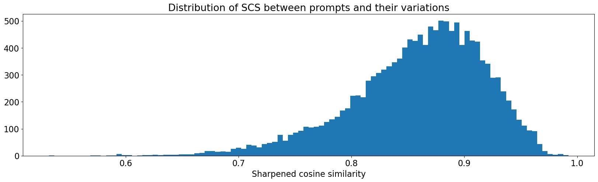

# Iteration 16. Similar prompts

_15-04-2024_

## Goal

Can I improve the LB score by training on data of similar prompts?

## Motivation

The idea is to have different prompts for the same sample that have the same meaning and high T5 similarity.
If I train on this data I believe the task will be better defined and the overfit will be smaller.

So the idea is to first use GPT4 to generate similar prompts, then measure similarity with T5 and finally
fine-tune Mistral on the new data.

## Development

I have parallelized the calls to GPT4 using 40 workers, that has decreased the generation time from 3.5 hours to just 5 minutes. The total cost of generating prompt variations was 11$.

The distribution is pretty good, 85% of the prompt variations score above `0.8`. I have used that threshold
to filter prompts with high similarity.

This has resulted on a new dataset of 14k samples. The original one was around 1.6k samples.

When combining both datasets I have 15,817 samples for training, with a batch size of 16 that would take around 1k steps to loop over all the data.

## Results

I get a LB score of `0.61`, worse than the `0.62` which is the best score for a fine-tuned model.

## Conclusion

No improvement when training on similar prompts.
